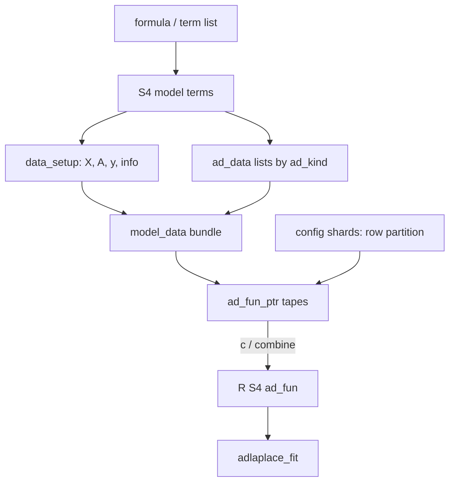
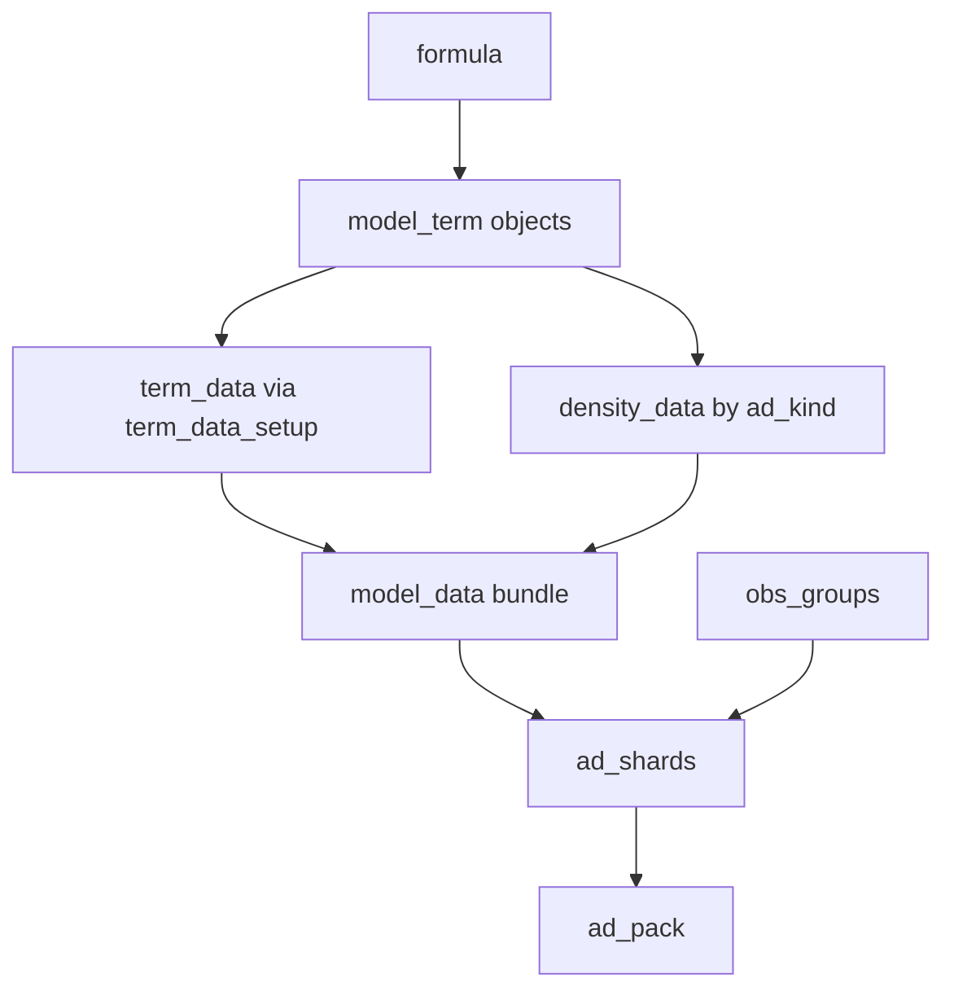

# adlaplace structure and proposed names

## Current pipeline

| Layer             | Current name                                                                  | What it is                                                               |
| ----------------- | ----------------------------------------------------------------------------- | ------------------------------------------------------------------------ |
| User model        | `formula` (or list of terms)                                                  | Parsed by `[collect_terms](adlaplace/R/effects.R)`                       |
| Term              | S4 `[model](adlaplace/R/classes.R)` subclasses (`iid`, `iwp`, `gaussian`, …)  | One formula piece; slots `@type`, `@ad_fun`, `@ad_kind`                  |
| Design assembly   | `[data_setup](adlaplace/R/data_setup.R)`                                      | Builds `X`/`A`/`y`/`info` from terms                                     |
| Full prep bundle  | `[model_data](adlaplace/R/model_data.R)`                                      | `{terms, data, observations, random, parameters}`                        |
| Density layout    | S4 `[ad_data](adlaplace/R/classes.R)`                                         | Per-density maps + matrices; one per contributing term (plus companions) |
| Obs row partition | `[ad_shards](adlaplace/R/ad_shards.R)` / `config$shards`                      | Columns = observation groups for parallel AD                             |
| Raw tapes         | `[ad_fun_ptr](adlaplace/R/ad_fun_ptr.R)` → C++ `ad_fun` of `adlaplace_shard`s | Recorded CppAD tapes                                                     |
| Fit-ready handle  | R S4 `[ad_fun](adlaplace/R/ad_fun.R)`                                         | Merged ptr + Hessian templates; vignettes already call this `ad_pack`    |

Two parallel classifications on terms (easy to mix up):

- `**@type**`: statistical role in the predictor — `"fixed"` | `"random"` | `"response"` (drives `X` vs `A`)
- `**@ad_kind**`: density role for taping — `"observations"` | `"parameters"` | `"random"` | `NA` (fixed terms have no density)

Your “each term has model_data” maps most closely to `**ad_data**`, not `model_data`. `model_data` is the **whole-model** bundle; each density-bearing term contributes one (sometimes two) `ad_data` entries into `$observations` / `$random` / `$parameters`. In the new names below, the `data_setup` output becomes `term_data` and `ad_data` becomes `density_data`.

---

## Naming pain points

1. `**ad_fun` is overloaded** — density name string (`@ad_fun`), R constructor/class, C++ struct, and CppAD `ADFun`.
2. `**ad_pack` is informal** — vignette variable for R S4 `ad_fun`; C++ uses `GroupPack` / param name `ad_pack` for a single tape.
3. `**shard` means three things** — an `ad_data` density contribution; an observation-row partition column; a C++ eval unit (`adlaplace_shard` / “group”).
4. `**model` vs whole model** — base class is really a *model_term*; `model_data` sounds per-term but is the assembled bundle.
5. `**model_data$data**` — nested `data` from `data_setup` is easy to misread.

---

## Proposed names (concrete)

Chosen to match your intuition (`term_data`, `ad_shard`, `ad_pack`) while keeping the whole-model bundle distinct from per-term density layout.

| Current                                                | Proposed                               | Notes                                                                              |
| ------------------------------------------------------ | -------------------------------------- | ---------------------------------------------------------------------------------- |
| S4 `model`                                             | `**model_term**`                       | Term in the model; subclasses stay (`iid`, `iwp`, …)                               |
| Slot `@term` (variable name)                           | `**@name**`                            | Avoids `x@term` reading oddly on a `model_term`; it holds the variable/column name |
| `@type`                                                | `**model_role**`                       | Role in the model: `"fixed"` / `"random"` / `"response"` — clearer vs density kind |
| `@ad_kind`                                             | `**ad_kind**` (keep)                   | Already clear: observations / parameters / random                                  |
| `@ad_fun` (string)                                     | `**density**`                          | Registry key only; stops clashing with objects                                     |
| `model_data()` / bundle                                | `**model_data**` (keep)                | Correctly names the *whole* assembly; not per-term                                 |
| `model_data$data`                                      | `**term_data**`                        | `data_setup` output: `X`, `A`, `y`, data frame, `info` tables — more than designs  |
| `data_setup()`                                         | `**term_data_setup()**`                | Builder matches the field it produces; drop old name                               |
| Generic `design(term, data)`                           | `**design()**` (keep)                  | No longer collides once `design_setup`/`$design` are dropped                       |
| S4 `ad_data`                                           | `**density_data**`                     | Per-density AD layout; pairs with `@density` and `ad_kind`                         |
| `extra_ad_fun()` generic                               | `**extra_density()**`                  | Returns a companion density name; matches `@density`                               |
| `.type_factor_levels`                                  | `**.model_role_levels**`               | Follows the `@type` → `model_role` rename                                          |
| Obs partition `ad_shards()` / `config$shards`          | `**obs_groups()**` / `config$obs_groups` | Disambiguate from tape shards; arg `num_shards` → `num_groups`                   |
| `shards=` subset arg in `grad()`/eval wrappers         | `**ad_shards=**`                       | It selects taped eval units, i.e. ad_shards                                        |
| One taped eval unit (C++ `adlaplace_shard`, R “group”) | `**ad_shard**`                         | The thing you evaluate / affinity-map                                              |
| Raw merged handle `ad_fun_ptr`                         | `**ad_pack_ptr**`                      | Pre-template combined tapes                                                        |
| R S4 `ad_fun` + `ad_fun()`                             | `**ad_pack**` / `**ad_pack()**`        | Matches vignette language; fit-ready combined object                               |
| `adlaplace_fit$ad_fun` field                           | `**$ad_pack**`                         | Fit object field follows the class rename                                          |
| C++ `struct ad_fun`                                    | `**ad_pack**`                          | Align R/C++; bump `ADLAPLACE_ABI_VERSION`                                          |
| C++ `GroupPack`                                        | `**AdTape**`                           | Internal per-tape state; rename for clarity                                        |

File renames to match the new layer names:

- `adlaplace/R/ad_fun.R` → `R/ad_pack.R`; `R/ad_fun_ptr.R` → `R/ad_pack_ptr.R`
- `adlaplace/R/ad_data.R` → `R/density_data.R`; `R/ad_shards.R` → `R/obs_groups.R`
- `adlaplace/R/data_setup.R` → `R/term_data_setup.R`
- C++ headers `inst/include/adlaplace/adfun.hpp` → `ad_pack.hpp`, `adfun_random.hpp` → `ad_pack_random.hpp` (and `src/adfun_random_mult.cpp` similarly)
- Regenerate roxygen docs (`man/`, `NAMESPACE`) after renames; bump `ADLAPLACE_ABI_VERSION` since the C++ `ad_fun` struct is renamed, forcing clean rebuilds of the extension packages

Target vocabulary in one sentence:

> A **formula** is a list of **model_term**s (each with a **model_role**); `model_data()` builds **term_data** (designs, response, parameter info) plus **density_data** by **ad_kind**; observation rows may be split into **obs_groups**; each density is taped into one or more **ad_shards**, which combine into an **ad_pack** for Laplace fitting.

---

## What not to rename (or only lightly)

- Density registry *strings* (`"random_mult"`, `"gaussian"`, …) — keep as-is; builders `create_ad_fun_*` become `create_ad_shard_*` since they produce taped eval units.
- Fit result `adlaplace_fit` and parameter blocks `beta` / `gamma` / `theta` — already clear.
- Extension packages’ term classes (`matern`, `hiwp`, `skewnormal`) — inherit rename of base `model_term` only.

---

## Docs and paper to update

Alongside package vignettes/man pages, update the methods paper:

- `[~/research/healthcanada/docs/adlaplace/paper/adlaplace.Rmd](/Users/patrick/research/healthcanada/docs/adlaplace/paper/adlaplace.Rmd)`

That file currently uses the old vocabulary in prose and code (`model_data`, `ad_fun`, `ad_data`, `ad_kind`, `ad_shards` / shard decomposition, `@ad_fun` slot). Align narrative and examples with the proposed names (`model_term`, `model_role`, `term_data`, `density_data`, `ad_pack`, `obs_groups`, `ad_shard`, `@density`), including the API sketch around `model_data` → `ad_pack` and the FEM/`density_data` construction examples.

Also grep the rest of `~/research/healthcanada` for old API names and update any scripts/docs that call into adlaplace.

---

## Migration approach (clean break)

Sole consumer today: the **adlaplace** monorepo (core + Example/Fem/Hgp) and **healthcanada**. Goal is maximum clarity, not compatibility.

- **No** temporary aliases, soft deprecations, or dual-name shims
- Rename in place (R classes/slots/functions, C++ types where they mirror R, man/vignettes/tests, paper)
- Prefer renaming confusing internals too when it helps readability (e.g. `data_setup` → `term_data_setup`, nested `$data` → `$term_data`, `GroupPack` → `AdTape`) rather than leaving legacy names “for later”
- Density registry *strings* (`"random_mult"`, …) can stay if renaming them is pure churn with no clarity win; the slot/API that *holds* the name still becomes `@density`
- Bump **`Version` to `0.6.0`** for the adlaplace family currently at `0.5.4`: [`adlaplace`](adlaplace/DESCRIPTION), [`adlaplaceExample`](adlaplaceExample/DESCRIPTION), [`adlaplaceFem`](adlaplaceFem/DESCRIPTION), [`adlaplaceHgp`](adlaplaceHgp/DESCRIPTION), [`hpolcc`](hpolcc/DESCRIPTION). Update any inter-package `Depends`/`Imports`/`LinkingTo` pins to require `adlaplace (>= 0.6.0)` (and sibling pins) as needed. Leave unrelated packages (`RCppAD`, `admvn`) unchanged unless they reference renamed APIs.

---

## Execution order (staged, each stage ends with a working build)

Work on a dedicated branch, one commit per stage:

1. **Core R layer** — rename classes, slots, generics, and functions in `adlaplace/R/` (including file renames); update roxygen and regenerate `NAMESPACE` / `man/`; run the adlaplace testthat suite.
2. **C++ layer** — rename `struct ad_fun` → `ad_pack`, `GroupPack` → `AdTape`, headers (`adfun.hpp` → `ad_pack.hpp`, `adfun_random.hpp` → `ad_pack_random.hpp`), `create_ad_fun_*` → `create_ad_shard_*`, registered routines / `.Call` entries; bump `ADLAPLACE_ABI_VERSION`; rebuild and rerun tests.
3. **Extension packages** — `adlaplaceExample`, `adlaplaceFem`, `adlaplaceHgp`, plus `hpolcc`; update each against the new API, rebuild, run each package's tests.
4. **Vignettes** — update all vignettes across the packages to the new vocabulary; confirm they knit.
5. **healthcanada** — update the paper `adlaplace.Rmd` and any other call sites found by grep; knit the paper.
6. **Version bumps** — set `0.6.0` and inter-package pins last, once everything builds.

## Final verification

- Grep both repos for stragglers: `\bad_data\b`, `\bad_fun\b` (excluding CppAD's `ADFun`), `data_setup`, `design_setup`, `GroupPack`, `config\$shards`, `num_shards`, `extra_ad_fun`, `\.type_factor_levels`, `@type\b` on terms, `ad_shards\(` (old obs-partition usage).
- Run `R CMD check` on all five packages (`adlaplace`, `adlaplaceExample`, `adlaplaceFem`, `adlaplaceHgp`, `hpolcc`).
- Knit the healthcanada paper end to end.

This naming map is **approved**. Do **not** execute the rename until explicitly asked; keep this file as the spec for the later clean-break migration.